[comment]: # "This is the standard layout for the project, but you can clean this and use your own template"

# Networked and Automated Weather Monitoring and Alerting System

---

## Team
-  E/14/009, ADIKARI A.M.H.I., [e14009@eng.pdn.ac.lk](mailto:e14009@eng.pdn.ac.lk)
-  E/14/404, WITHANA S.S.P., [e14404@eng.pdn.ac.lk](mailto:e14404@eng.pdn.ac.lk)
-  E/14/410, DILSHAN I.D.H.I., [e14410@eng.pdn.ac.lk](mailto:e14410@eng.pdn.ac.lk)

## Table of Contents
1. [Introduction](#introduction)
2. [Solution Architecture](#solution-architecture )
3. [Hardware & Software Designs](#hardware-and-software-designs)
4. [Links](#links)

---

## Introduction

Weather conditions and climate changes must be logged and analyzed by relevant authorities like meteorological department each day. They take relevant actions observing those records obtained allover the island. But in the current manual system they collect information only from main cities and  taking responses manually takes much time and effort.

So in this unified project we develop a system that can be used to collect information from much many places allover Sri Lanka using an embedded system kept in those locations. The locations may be places in each district close to sea, rivers, reservoirs, tanks and other areas. The data are wind speed, rain status, rainfall, humidity, temperature etc.

All those data taken from those sensors, are sent to a central server and processed there. If there are extreme weather cases, public must be warned. So the web application gives instant alerts to it's users including relevant central authorities as well as regional authorities. The process is very quicker than manual method. So the damages due to extreme weather is reduced as well as meteorological department will have newest data from allover the country.  

- [Introduction Video](https://youtu.be/5pYDfkILeco)

## Solution Architecture

### Embedded Systems Design
1. What will you be measuring and/or controlling?
    - In this unified project we develop a system that can be used to collect information from much many places allover Sri Lanka using an embedded system kept in those locations. The locations may be places in each district close to sea, rivers, reservoirs, tanks and other areas. The data are wind speed, wind direction, rainfall, humidity, temperature.
    - Actually we are not going to control any physical quantity since weather cannot be controlled. We are only sensing the weather conditions and reporting.But we have few cases where it is needed to do an physical action based on the sensed data.That is the valve we use to remove water from rainfall-meter must be open only if water is filled and closed when water is removed totally.So the ultra-sonic sensor data is used to control the valve.

2. What embedded systems platform(s) will you be using, and why?
    - The combined embedded system will have following main sub parts.

    - Wind Speed Sensing System - This is a wind Vane that rotates with wind. We are making a mechanism using IR sensor to get the time taken to complete a full cycle by vane. The wind speed is calculated using that data.
    - Wind direction measuring System

    - Rainfall measuring System - This has a cylindrical vessel with fixed cross section that collects rain water and measure the water level using an ultrasound sensor kept few cm below top of the vessel. Sensor not having at top most is to avoid water drops to go away hitting the sensor.

    - Temperature and Humidity measuring System - This is a single sensor that sense temperature and humidity.

    - Microcontroller - We use Atmega328p microcontroller for each node connecting all the above mentioned sub parts.

3. How does the system connect to the network?

    - System connects to network using GSM module. we use SIM808 module for that.

4. What peripheral components will you be using, and how do they work? How do they interface

    - IR sensor used in wind speed sensing, magnetometer used in wind direction sensing, ultra-sonic sensor used in rainfall sensing and also the temperature/humidity sensor will connect to the Arduino UNO board.
    - The automatic valve used to remove water when needed will also connect to the Arduino Uno.
    - The SIM808 will connect to serial ports of arduino UNO (using two PMW enabled digital pins and Software Serial library).

5. What are the limitations of those components?
    - The magnetometer we bought doesn't give reliable readings as we expected. That is a limitation.
    - The ultra-sonic sensor give reliable readings only when the water surface doesn't shake.

6. what workarounds can you come up with in order to deal with those limitations?
    - We have to remove magnetometer from sensing. We need to use another technology to gain the wind direction.
 

### Web and Network Application Design
1. What network protocols and middleware will you use, why, and how do they work?
    - We use SIM808 GSM module as middleware and use HTTP protocol to send data.
    - TCP/IP is used to get the connection.

2. What back-end and front-end technologies will you use, and how do they work?
    - Back-end technology is PHP and Front-end technology is HTML5. PHP used to get URL encoded data and to send data to database sing MYSQL queries.

3. What APIs will you use when connecting different parts of the system?
    - GoogleMap APIs are to be used in getting map services to the user interface.

### Computer and Network Security
1. Are there any sensitive data in your system that need to be secured?
    - All the data are weather related data. They must be protected from unauthorized changes.

2. How might an unauthorized third party obtain data from your system?
    - Unauthorized third party could access the data and has no problem. As the data are visible to anyone easily on the front end, no one will need to access data  unethically.

3. How might an unauthorized third party manipulate your system?
    - Unauthorized third party should not be allowed to manipulate the system. Reliability and accuracy of data must be maintained.

4. What security features are you able to implement, and how?
    - As the very important data are sent to the central server from systems in rural places, the security of data is a fact to consider much. As stated by the examiners of Project Milestone 1 in comments, data encryption is not required in this case because we  not need to hide data from anyone. Only thing we need is to protect data from being changed externally. So we are going to use MAC -Message authentication code for the requirement.

## Hardware and Software Designs

### Embedded system  
The combined embedded system will have 6 main sub parts.  
#### Wind Speed Sensing System  
  - This is a wind Vane that rotates with wind. We are making a mechanism using IR sensor to get the time taken to complete a full cycle by vane. The wind speed is calculated using that data.
  - The model wind vane concept is given below.  
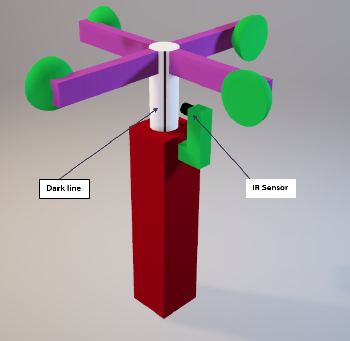  
  - Infrared barrier module is the IR sensor we are planning to use. It emits infra red waves and monitor the reflected rays. It can identify black and white screens.  

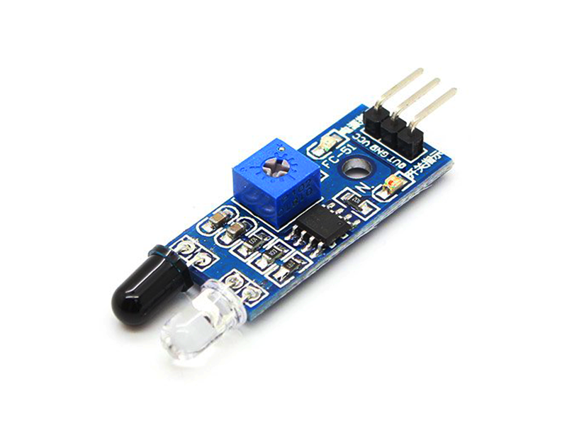  

#### Wind direction measuring System  
  - Wind direction is measured using a Vane that has a Triple-axis Magnetometer (Compass) Board - HMC5883L0
  - Below is the model.  

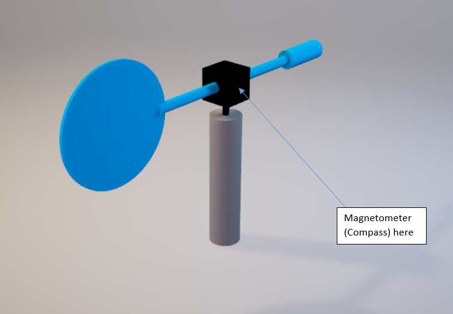  

  - Triple-axis Magnetometer (Compass) Board - HMC5883L is the sensor used to get the angle of rotation.  

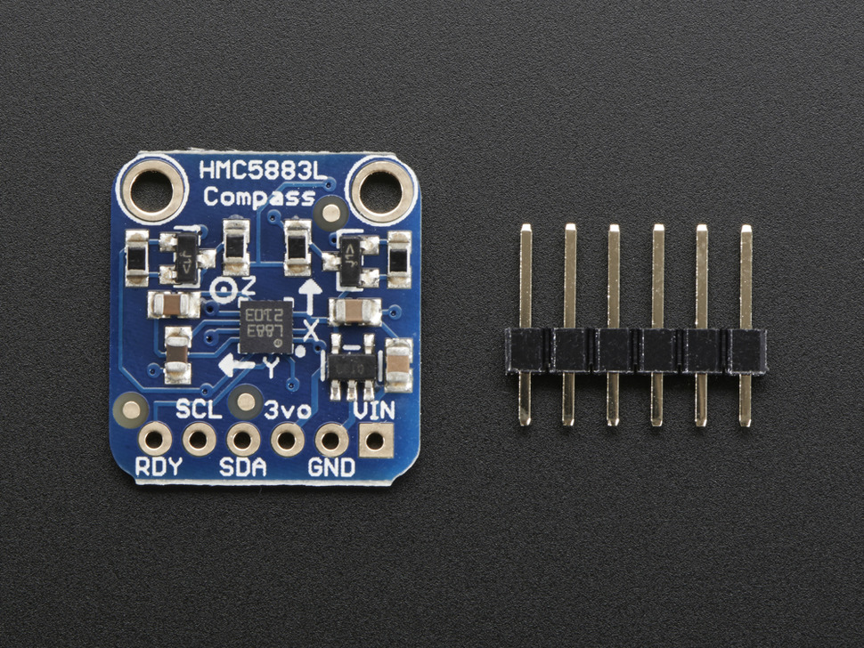  

#### Rainfall measuring System  

  - This has a cylindrical vessel with fixed cross section that collects rain water and measure the water level using an ultrasound sensor kept few cm below top of the vessel. Sensor not having at top most is to avoid water drops to go away hitting the sensor.
  - Also this has a automatic valve to remove water daily after reporting to server, based on the sonar sensor reading.
  - Also this has a rain sensor to identify whether it is raining or not.  
  - This is the ultrasonic sensor we are planning to use (HC-SR04)  

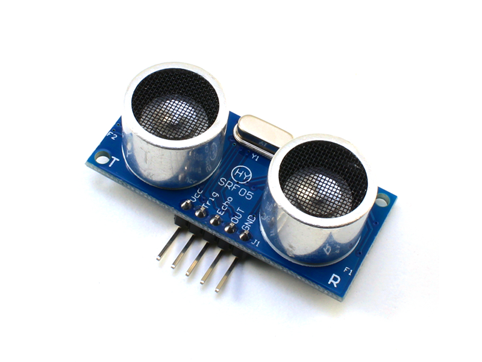  

  - This is the automatic valve we are using. It is a plastic solenoid valve  

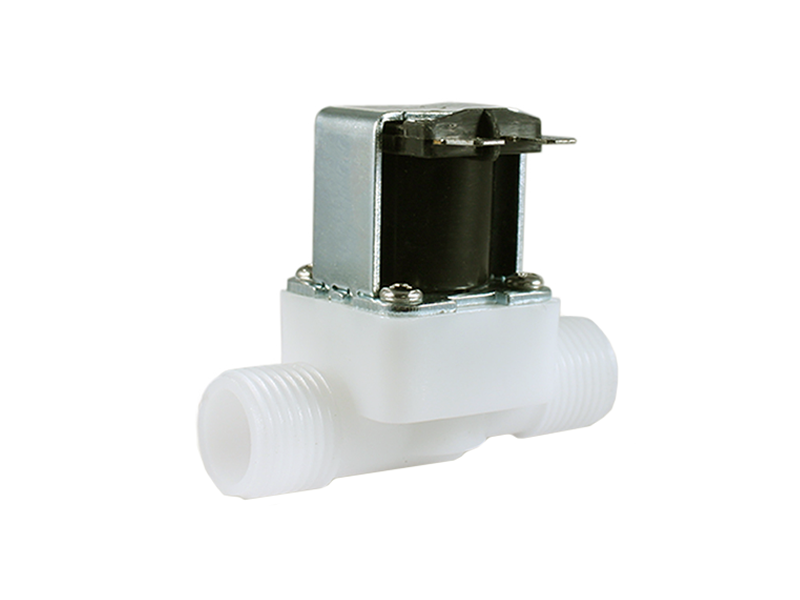  

#### Temperature and Humidity measuring System  
  - This is a single sensor that sense temperature and humidity.
  - For that we use Humidity and Temperature DHT11 Module  

#### Microcontroller  
  - We use Atmega328p microcontroller for each node connecting all the above mentioned sub parts.  

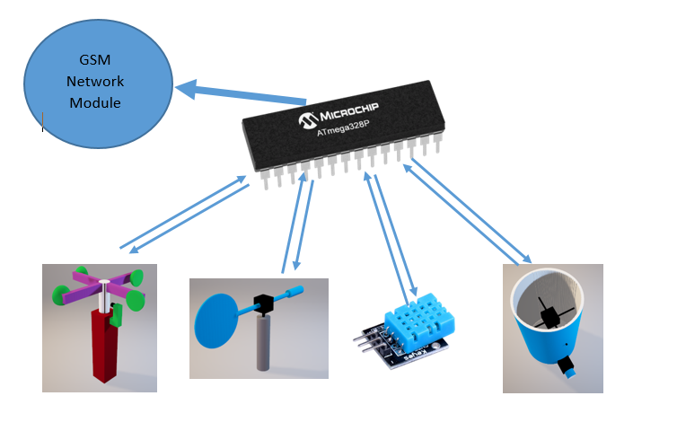  
  - We will use ARDUINO UNO board which has Atmega328p microcontroller.  

  

#### Network Module  

  - As we need the embedded unit at places normally we can't expect WIFI access, we decided to use a GSM module to send data collected to the central server.

  - So the GSM module we are using is  sim808 module.

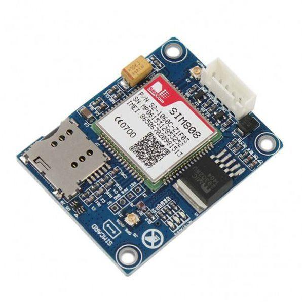  

### WEB APPLICATION  

We are sending the data collected in each time to the central database. we have implemented the database in 000webhost.com. So we are implementing a web application for users to view the data log using a user interface.

We are sending data using protocol HTTP. HTTP GET request is used to send data. The microcontroler will send requests to the SIM808 as AT commands using serial port. Software Serial is used for that as digital pins are used for serial data sending.

Front end will run HTML5 and back end will run PHP maintaining the connection with the database. MYSQL is used for database managing.

User interface will allow users to view parameters rainfall, wind direction, wind speed, temperature, humidity based on map(current situation/latest) also based on time(history).

This photo is an example image.  

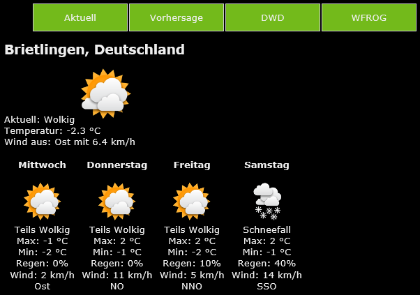  

The design of the Back End programme of the web application is given below.  

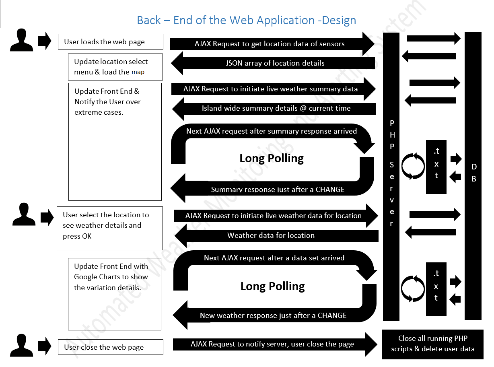

### NETWORK SECURITY  

As the very important data are sent to the central server from systems in rural places, the security of data is a fact to consider much. As stated by the examiners of Project Milestone 1 in comments, data encryption is not required in this case because we  not need to hide data from anyone. Only thing we need is to protect data from being changed externally. So we are going to use [MAC-Message authentication code](http://www.crypto-it.net/eng/theory/mac.html) for the requirement.  

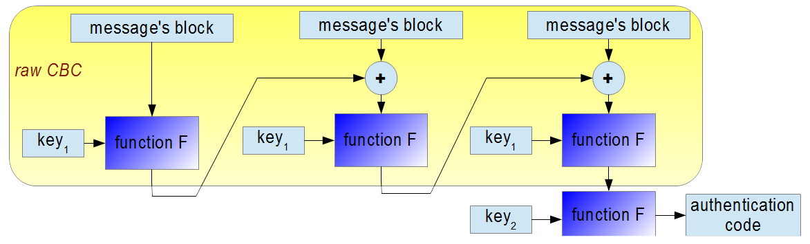  

### Rainfall measuring System  

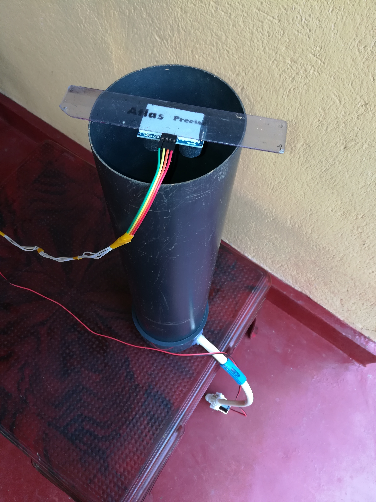
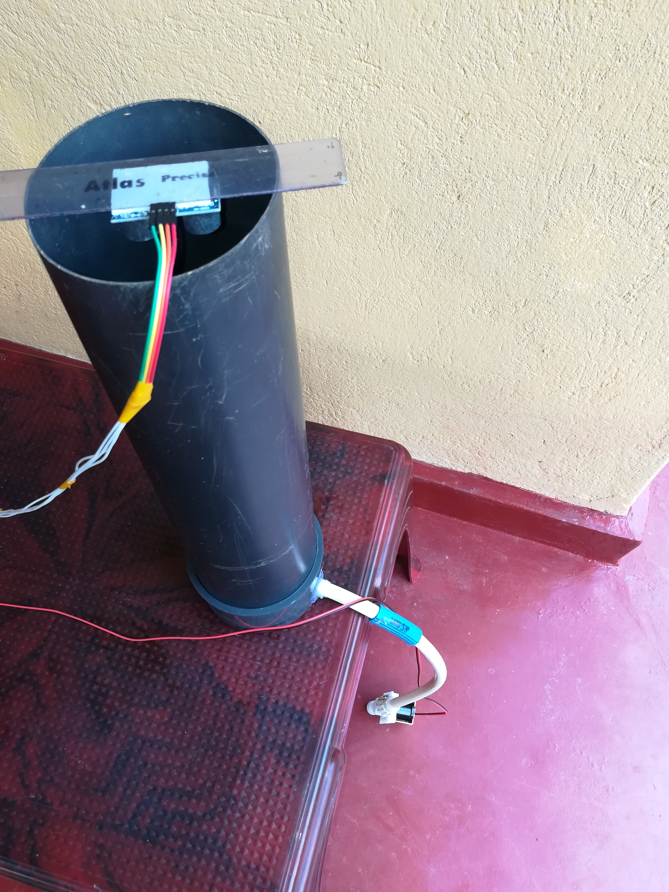
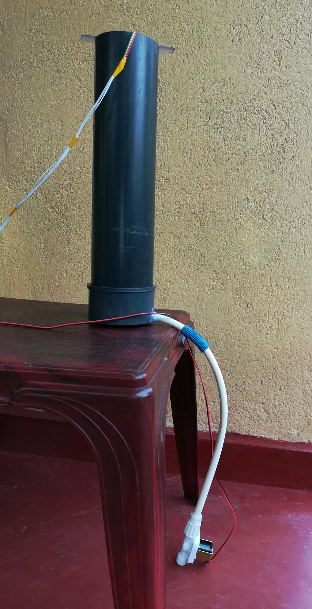  

### Wind Speed Sensing System  

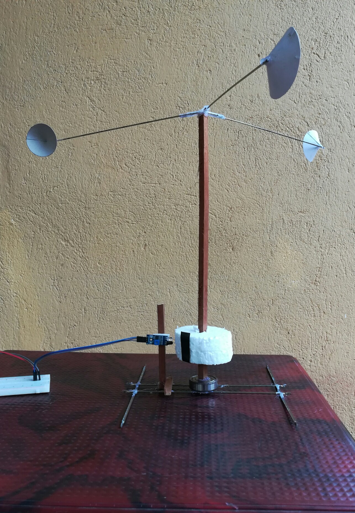  

### Demonstrations  

  - [This is the video depicting the operation of GSM/GPRS module to send weather data to the server at 000webhost.com and how basic front end display it.](https://youtu.be/8j5CJ-U_rQU)  
  - [This is a video demonstration of the functioning of the Embedded system including the sensors, GSM module and web application. All the sensors are working fine now. Only few are demonstrated in the video.](https://youtu.be/Bitjx8XXnLc)  

### Documents  
  - [Project Report](data/documents/1.pdf)  
  - [Design Document](data/documents/2.pdf)

## Links

- <a href = "https://github.com/cepdnaclk/e14-3yp-Networked-and-Automated-Weather-Monitoring-and-Alerting-System" target = "_blank">Project Repository</a>
- <a href = "https://cepdnaclk.github.io/e14-3yp-Networked-and-Automated-Weather-Monitoring-and-Alerting-System/" target = "_blank">Project Page</a>
- <a href = "http://www.ce.pdn.ac.lk/" target = "_blank">Department of Computer Engineering</a>
- <a href = "https://eng.pdn.ac.lk/" target = "_blank">University of Peradeniya</a>

[//]: # (Please refer this to learn more about Markdown syntax)
[//]: # (https://github.com/adam-p/markdown-here/wiki/Markdown-Cheatsheet)
